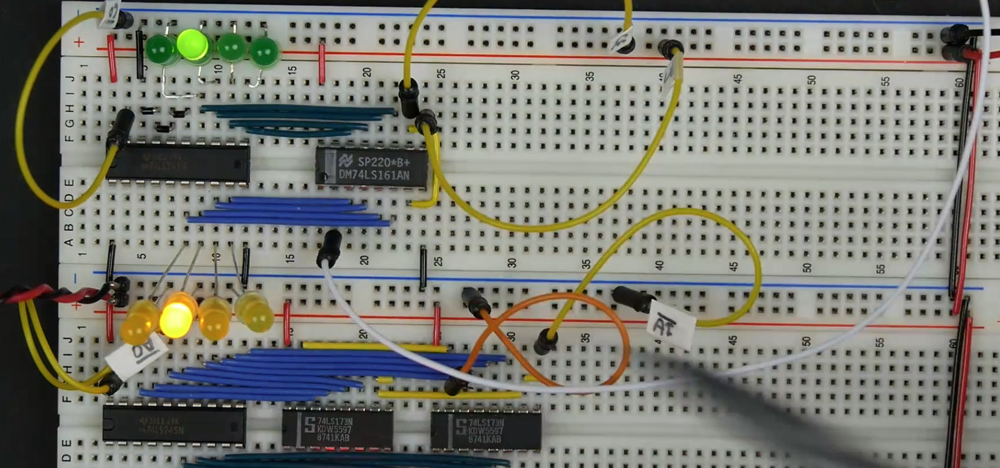
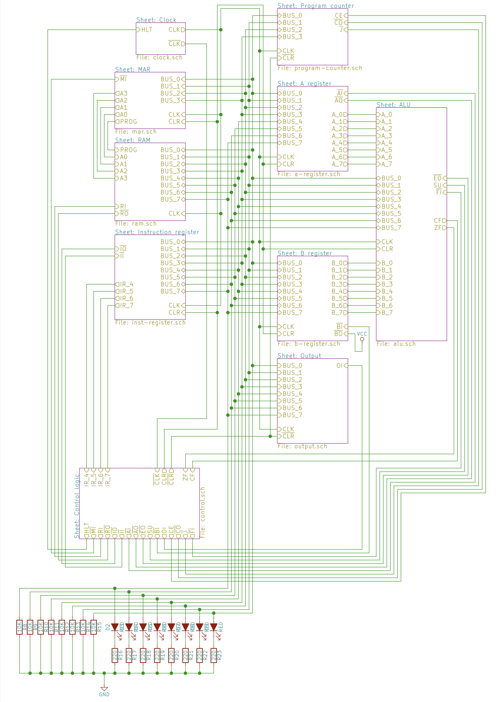
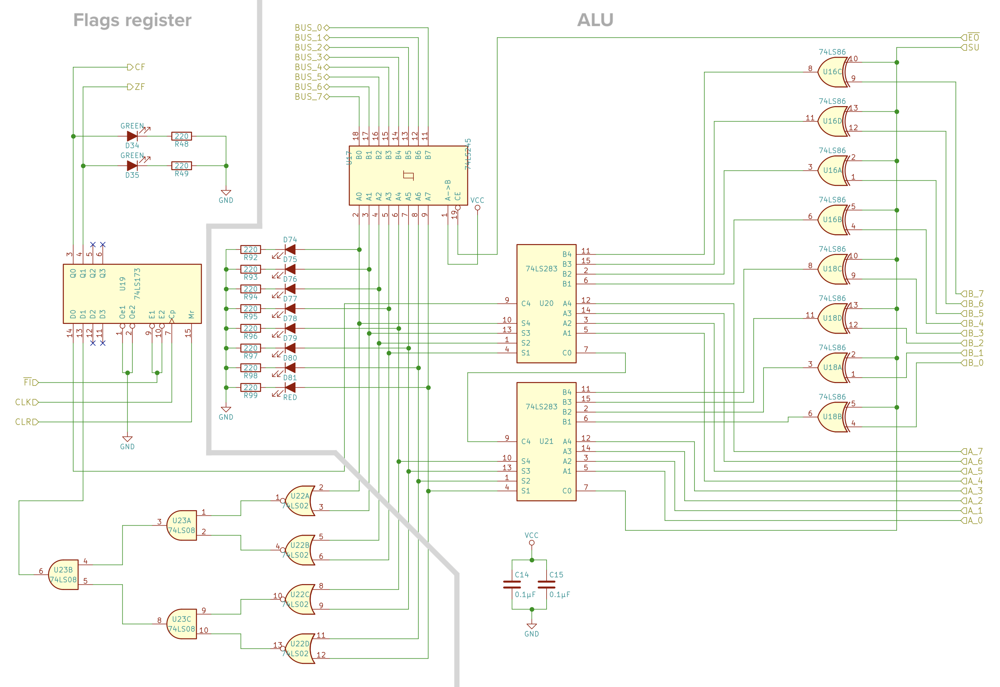

# 🎛️ 8-Bit Breadboard Computer | From Logic Gates to Working Computer
  

## 🚀 Overview

> **"Understanding computing at its most fundamental level."**
> This project implements a programmable 8-bit computer on breadboards using basic TTL logic chips. No microcontrollers, no CPUs - just logic gates!
  

- ✅ **Low-level architecture** with ALU, registers, program counter and control unit
- ✅ **Runs machine code** programs with self-designed instructions
- ✅ **Hand-wired** on standard breadboards
  
---
  
## 📸 How it looks?

### 1. The Complete System

  

*The fully assembled 8-bit breadboard computer*

### 2. Component Close-ups

<table width="100%" style="border-collapse: collapse;">
  <tr>
    <td width="33.33%" align="center" style="padding: 20px; border: 1px solid #e1e4e8; vertical-align: top; width: 300px; height: 350px;">
      <h3 style="font-size: 1.4em; margin: 0 0 20px 0;"> ALU Unit</h3>
       
      
<em>ALU able to add and subtract.</em>

    </td>
    <td width="33.33%" align="center" style="padding: 20px; border: 1px solid #e1e4e8; vertical-align: top; width: 300px; height: 350px;">
      <h3 style="font-size: 1.4em; margin: 0 0 20px 0;"> Clock</h3>
       
      
<em>Adjustable-speed clock module with a manual mode.</em>

    </td>
    <td width="33.33%" align="center" style="padding: 20px; border: 1px solid #e1e4e8; vertical-align: top; width: 300px; height: 350px;">
      <h3 style="font-size: 1.4em; margin: 0 0 20px 0;"> Registers</h3>
       
      
<em>Three 8-bit registers: A, B, and IR.</em>

    </td>
  </tr>
  <tr>
    <td width="33.33%" align="center" style="padding: 20px; border: 1px solid #e1e4e8; vertical-align: top; width: 300px; height: 350px;">
      <h3 style="font-size: 1.4em; margin: 0 0 20px 0;"> RAM</h3>
       
      
<em>16 bytes of RAM with 4-bit addresses.</em>

    </td>
    <td width="33.33%" align="center" style="padding: 20px; border: 1px solid #e1e4e8; vertical-align: top; width: 300px; height: 350px;">
      <h3 style="font-size: 1.4em; margin: 0 0 20px 0;"> Program Counter</h3>
       
      
<em>PC keeps track of currently executing instructions.</em>

    </td>
    <td width="33.33%" align="center" style="padding: 20px; border: 1px solid #e1e4e8; vertical-align: top; width: 300px; height: 350px;">
      <h3 style="font-size: 1.4em; margin: 0 0 20px 0;"> Control Unit</h3>
       
      
<em>Instruction decoding and execution logic.</em>

    </td>
  </tr>
</table>

---
  
## 🏗️ How it works?

### 1. Completed System Schematics

  

*The fully assembled 8-bit breadboard computer*

### 2. Component Schematics

<table width="100%" style="border-collapse: collapse;">
  <tr>
    <td width="33.33%" align="center" style="padding: 20px; border: 1px solid #e1e4e8; vertical-align: top; width: 300px; height: 350px;">
      <h3 style="font-size: 1.4em; margin: 0 0 20px 0;"> ALU Unit</h3>
       
      
<em>ALU able to add and subtract.</em>

    </td>
    <td width="33.33%" align="center" style="padding: 20px; border: 1px solid #e1e4e8; vertical-align: top; width: 300px; height: 350px;">
      <h3 style="font-size: 1.4em; margin: 0 0 20px 0;"> Clock</h3>
       
      
<em>Adjustable-speed clock module with a manual mode.</em>

    </td>
    <td width="33.33%" align="center" style="padding: 20px; border: 1px solid #e1e4e8; vertical-align: top; width: 300px; height: 350px;">
      <h3 style="font-size: 1.4em; margin: 0 0 20px 0;"> Registers</h3>
       
      
<em>Three 8-bit registers: A, B, and IR.</em>

    </td>
  </tr>
  <tr>
    <td width="33.33%" align="center" style="padding: 20px; border: 1px solid #e1e4e8; vertical-align: top; width: 300px; height: 350px;">
      <h3 style="font-size: 1.4em; margin: 0 0 20px 0;"> RAM</h3>
       
      
<em>16 bytes of RAM with 4-bit addresses.</em>

    </td>
    <td width="33.33%" align="center" style="padding: 20px; border: 1px solid #e1e4e8; vertical-align: top; width: 300px; height: 350px;">
      <h3 style="font-size: 1.4em; margin: 0 0 20px 0;"> Program Counter</h3>
       
      
<em>PC keeps track of currently executing instructions.</em>

    </td>
    <td width="33.33%" align="center" style="padding: 20px; border: 1px solid #e1e4e8; vertical-align: top; width: 300px; height: 350px;">
      <h3 style="font-size: 1.4em; margin: 0 0 20px 0;"> Control Unit</h3>
       
      
<em>Instruction decoding and execution logic.</em>

    </td>
  </tr>
</table>

